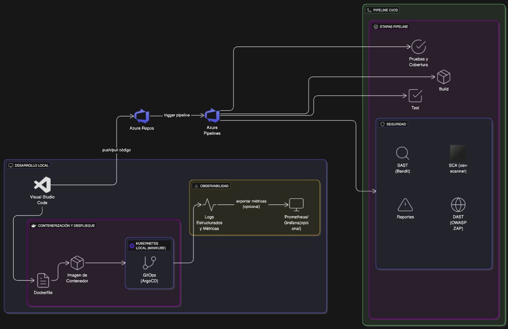

# Proyecto de Demostración de API Experimental

Un proyecto de demostración de una API REST lista para producción que muestra las mejores prácticas de DevSecOps, incluyendo CI/CD, contenedorización, escaneo de seguridad y despliegue con GitOps.

---

## Descripción del Proyecto

Este proyecto implementa una API simple de lista de tareas (To-Do List) con las siguientes características:

* API REST basada en FastAPI con operaciones CRUD.
* Suite de pruebas completa con alta cobertura de código.
* Registro de JSON estructurado.
* Métricas de Prometheus para observabilidad.
* Construcción de Docker en múltiples etapas con las mejores prácticas de seguridad.
* Pipeline de CI/CD en Azure DevOps con escaneo de seguridad.
* Manifiestos de despliegue de Kubernetes.
* Estrategia de despliegue GitOps con ArgoCD.

---

## Diagrama de arquitectura DevSecOps



## Estructura del Repositorio

```
api-experimental-prototype/
├── app/                  # Código de la aplicación de la API
│   ├── __init__.py
│   ├── main.py           # Punto de entrada de la aplicación FastAPI
│   └── models.py         # Modelos de datos
├── tests/                # Suite de pruebas
│   ├── __init__.py           
│   └── test_main.py                  
├── k8s/                  # Manifiestos de Kubernetes
│   ├── deployment.yaml
│   ├── service.yaml
│   └── monitoring/       # Configuración de monitoreo
│       ├── prometheus.yaml
│       ├── prometheus-deployment.yaml
│       ├── grafana-deployment.yaml
│       └── api-dashboard.json
├── argocd/               # Configuración de ArgoCD
│   └── application.yaml
├── Dockerfile            # Construcción de Docker en múltiples etapas
├── requirements.txt      # Dependencias de Python
├── openapi.json          # Especificación de la API para escaneo DAST
└── azure-pipelines.yml   # Configuración del pipeline de CI/CD
```

---

## Endpoints de la API

| Método | Ruta | Descripción |
| --- | --- | --- |
| `POST` | `/tasks` | Crea una nueva tarea. |
| `GET` | `/tasks` | Lista todas las tareas. |
| `GET` | `/tasks/{task_id}` | Obtiene una tarea específica. |
| `PUT` | `/tasks/{task_id}` | Actualiza una tarea. |
| `DELETE` | `/tasks/{task_id}` | Elimina una tarea. |
| `GET` | `/health` | Endpoint de verificación de estado. |
| `GET` | `/metrics` | Endpoint de métricas de Prometheus. |

---

## Instrucciones de Despliegue

### 1. Desarrollo Local

**Prerrequisitos:**
* Python 3.12+
* Docker

**Configuración:**

1.  Clona el repositorio:
    ```bash
    git clone https://github.com/yourusername/api-experimental-prototype.git
    cd api-experimental-prototype
    ```

2.  Crea un entorno virtual e instala las dependencias:
    ```bash
    python -m venv venv
    source venv/bin/activate  # En Windows: venv\Scripts\activate
    pip3 install -r requirements.txt
    ```

3.  Ejecuta la aplicación:
    ```bash
    uvicorn app.main:app --reload
    ```
    Accede a la documentación de la API en `http://localhost:8000/docs`.

**Ejecutando Pruebas:**
```bash
pytest tests/ --cov=app
```

### 2. Despliegue con Docker

**Construir y Ejecutar Localmente:**
```bash
docker build -t experimental-api:latest .
docker run -p 8000:8000 experimental-api:latest
```

**Subir a un Registro de Contenedores:**

* **Para Docker Hub:**
    ```bash
    docker tag experimental-api:latest tuusuario/experimental-api:latest
    docker push tuusuario/experimental-api:latest
    ```

* **Para Azure Container Registry:**
    ```bash
    az acr login --name turegistro
    docker tag experimental-api:latest turegistro.azurecr.io/experimental-api:latest
    docker push turegistro.azurecr.io/experimental-api:latest
    ```

### 3. Despliegue en Kubernetes (Manual)

**Prerrequisitos:**
* Clúster de Kubernetes (Minikube, AKS, EKS, etc.).
* `kubectl` configurado para acceder a tu clúster.

**Desplegar la API:**

1.  Crea el namespace:
    ```bash
    kubectl create namespace experimental-api
    ```

2.  Aplica los manifiestos de Kubernetes:
    ```bash
    kubectl apply -f k8s/deployment.yaml -n experimental-api
    kubectl apply -f k8s/service.yaml -n experimental-api
    ```

3.  Verifica el despliegue:
    ```bash
    kubectl get pods -n experimental-api
    kubectl get svc -n experimental-api
    ```

4.  Accede a la API (reenvío de puertos):
    ```bash
    kubectl port-forward svc/experimental-api 8000:80 -n experimental-api
    ```

### 4. Configuración de Monitoreo

**Prerrequisitos:**
* Clúster de Kubernetes con Prometheus y Grafana.

**Desplegar el Stack de Monitoreo:**

1.  Crea el namespace de monitoreo:
    ```bash
    kubectl create namespace monitoring
    ```
2.  Despliega Prometheus:
    ```bash
    kubectl apply -f k8s/monitoring/prometheus.yaml -n monitoring
    kubectl apply -f k8s/monitoring/prometheus-deployment.yaml -n monitoring
    ```
3.  Despliega Grafana:
    ```bash
    kubectl apply -f k8s/monitoring/grafana-deployment.yaml -n monitoring
    ```
4.  Espera a que Grafana esté listo:
    ```bash
    kubectl wait --for=condition=ready pod -l app=grafana -n monitoring --timeout=120s
    ```
5.  Accede a Grafana:
    ```bash
    kubectl port-forward svc/grafana 3000:3000 -n monitoring
    ```
    * La UI de Grafana estará disponible en `http://localhost:3000`.
    * **Usuario:** admin, **Contraseña:** admin

### 5. Despliegue con GitOps y ArgoCD

**Prerrequisitos:**
* Clúster de Kubernetes.
* Repositorio de Git con tu código de aplicación y manifiestos de Kubernetes.

**Instalar ArgoCD:**

1.  Crea el namespace de ArgoCD:
    ```bash
    kubectl create namespace argocd
    ```
2.  Instala ArgoCD:
    ```bash
    kubectl apply -n argocd -f https://raw.githubusercontent.com/argoproj/argo-cd/stable/manifests/install.yaml
    ```
3.  Espera a que ArgoCD esté listo:
    ```bash
    kubectl wait --for=condition=ready pod -l app.kubernetes.io/name=argocd-server -n argocd --timeout=300s
    ```
4.  Accede a la UI de ArgoCD:
    ```bash
    kubectl port-forward svc/argocd-server -n argocd 8080:443
    ```
5.  Obtén la contraseña inicial de administrador:
    ```bash
    kubectl -n argocd get secret argocd-initial-admin-secret -o jsonpath="{.data.password}" | base64 -d
    ```

**Desplegar la Aplicación con ArgoCD:**

1.  Aplica el manifiesto de la aplicación de ArgoCD:
    ```bash
    kubectl apply -f argocd/application.yaml
    ```
2.  Verifica el estado de la aplicación:
    ```bash
    kubectl get applications -n argocd
    ```

**Usando la UI de ArgoCD:**
* Accede a la UI de ArgoCD en `https://localhost:8080`.
* Inicia sesión con el usuario `admin` y la contraseña obtenida anteriormente.
* Deberías ver tu aplicación en el panel de control.
* Haz clic en la aplicación para ver los detalles del despliegue.
* Usa el botón "Sync" para activar manualmente un despliegue si es necesario.

---

## Configuración del Pipeline de CI/CD (Azure DevOps)

**Prerrequisitos:**
* Cuenta de Azure DevOps.

**Configurar el Pipeline:**

1.  Importa tu repositorio a Azure DevOps.
2.  Crea un nuevo pipeline usando el archivo existente `azure-pipelines.yml`.
3.  Configura las siguientes variables:
    * `pythonVersion`: Versión de Python a usar (ej., `'3.12'`).
    * `image_tag`: Nombre del tag de tu imagen de contenedor obtenido del BuildID.
    * `image_name`: Nombre de la imagen con su tag de contenedor.

4.  Ejecuta el pipeline.

El pipeline realizará las siguientes acciones:
* Validará el código con pruebas y escaneos de seguridad.
* Construirá y subirá la imagen de Docker.
* Escaneará la imagen del contenedor en busca de vulnerabilidades.
* Ejecutará pruebas de seguridad DAST.
* Actualizará los manifiestos de Kubernetes con la nueva etiqueta de la imagen.
* Confirmará los cambios para activar el despliegue de ArgoCD.

---

## Características de Seguridad

* Escaneo SAST con **Bandit**.
* Escaneo SCA con **OSV Scanner**.
* Escaneo de contenedores con **Trivy**.
* Escaneo DAST con **OWASP ZAP**.
* Usuario no-root en el contenedor Docker.
* Contexto de seguridad en el despliegue de Kubernetes.
* Límites de recursos en el despliegue de Kubernetes.
* Encabezados de seguridad para vulnerabilidades web.

---

## Observabilidad

* Registro de JSON estructurado.
* Métricas de Prometheus.
* Endpoint de verificación de estado.
* Sondas de `liveness` y `readiness` de Kubernetes.
* Paneles de Grafana para visualización.

---

## Solución de Problemas

**Problemas Comunes:**

* **La API no es accesible después del despliegue:**
    * Verifica el estado del pod: `kubectl get pods -n experimental-api`
    * Verifica los registros: `kubectl logs -l app=experimental-api -n experimental-api`
    * Verifica el servicio: `kubectl get svc -n experimental-api`

* **ArgoCD no se sincroniza:**
    * Verifica el estado de la aplicación: `kubectl get applications -n argocd`
    * Ve el estado detallado: `kubectl describe application experimental-api -n argocd`
    * Verifica los registros de ArgoCD: `kubectl logs -l app.kubernetes.io/name=argocd-server -n argocd`

* **Prometheus no recopila métricas:**
    * Verifica la configuración del objetivo: `kubectl get configmap prometheus-config -n monitoring -o yaml`
    * Verifica si la API está exponiendo métricas: `curl http://localhost:8000/metrics`
    * Asegúrate de que el servicio tenga las anotaciones correctas: `prometheus.io/scrape: "true"`

---

## Contribuciones

1.  Haz un fork del repositorio.
2.  Crea una rama de funcionalidad: `git checkout -b feature/tu-funcionalidad`
3.  Confirma tus cambios: `git commit -am 'Añade tu funcionalidad'`
4.  Sube a la rama: `git push origin feature/tu-funcionalidad`
5.  Envía una pull request.


## Decisiones Técnicas y Selección de Herramientas

A continuación, se detallan las decisiones clave sobre la tecnología y las herramientas utilizadas en este proyecto, explicando el razonamiento detrás de cada elección.

* **Lenguaje de Programación: Python**
    * **Justificación:** Se optó por Python debido a su ecosistema maduro para el desarrollo de APIs REST, permitiendo una implementación rápida y limpia mediante frameworks como FastAPI. Su sintaxis clara facilita la mantenibilidad del código a largo plazo.

* **CI/CD: Azure DevOps**
    * **Justificación:** Se seleccionó Azure DevOps por ser una plataforma integral que centraliza el ciclo de vida del desarrollo de software. Provee un conjunto de herramientas robusto para la automatización de pipelines de CI/CD de forma eficiente y escalable.

* **Análisis Estático de Seguridad (SAST): Bandit**
    * **Justificación:** La elección de Bandit responde al objetivo de integrar una herramienta de seguridad especializada en la detección de vulnerabilidades comunes en código Python, diversificando el stack de seguridad más allá de soluciones tradicionales.

* **Análisis de Dependencias (SCA) y Escaneo de Imágenes: OSV-Scanner y Trivy**
    * **Justificación:** Se adoptó una estrategia de seguridad por capas: **OSV-Scanner** se utiliza para el análisis de dependencias (SCA) gracias a su simplicidad y fácil integración, mientras que **Trivy** se reserva para el escaneo de la imagen Docker, donde es altamente eficaz.

* **Contenerización: Docker**
    * **Justificación:** El uso de un `Dockerfile` es el estándar de la industria para la construcción de imágenes de contenedores. Este enfoque garantiza un empaquetado reproducible, inmutable y portátil de la aplicación.

* **Entorno de Kubernetes Local: Minikube**
    * **Justificación:** Se utiliza Minikube por su capacidad para emular un clúster de Kubernetes de un solo nodo de manera local. Esto es fundamental para desarrollar y validar los manifiestos de la aplicación en un entorno que refleja fielmente la producción.

* **Entrega Continua (GitOps): ArgoCD**
    * **Justificación:** Se implementa ArgoCD para adoptar una estrategia de GitOps. Esta herramienta permite gestionar los despliegues de forma declarativa, utilizando el repositorio de Git como la única fuente de la verdad para el estado deseado de la aplicación.

* **Monitoreo y Observabilidad: Prometheus y Grafana**
    * **Justificación:** Se incorpora una pila de monitoreo con Prometheus para la recolección de métricas y Grafana para su visualización. Estas herramientas son estándares de facto en la industria y son cruciales para construir una arquitectura con alta observabilidad, orientada a la operación y al mantenimiento proactivo.

    